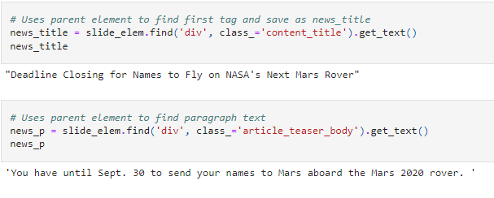
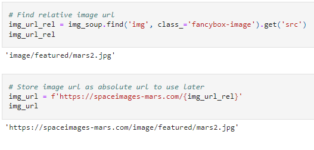
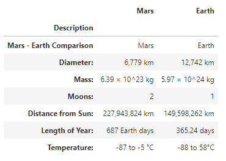
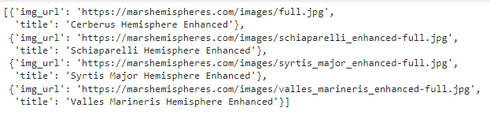

# web-scraping-challenge
## GA Tech Data Science and Analytics Boot Camp Module 12
### Description

This module utilizes new concepts, such as web scraping with BeautifulSoup and MongoDB, and former concepts like HTML, Bootstrap, and Flask to develop an application that will scrape data from four sites and display the data through a Flask application.

<h1>Part 1: Scraping</h1>

This module first starts with a Python Jupyter notebook in order to utilize BeautifulSoup, Pandas, and Requests/Splinter to scrape for data.

The four sites that data is scraped from include:

* <a href="https://redplanetscience.com/">NASA Mars News</a>
    - Collect the latest News Title and Paragraph Text

* <a href="https://spaceimages-mars.com/">JPL Marks Space Images-Featured Image</a>
    - Save complete URL string for the featured image

* <a href="https://galaxyfacts-mars.com/">Mars Facts</a>
    - Collect table containing facts about Mars

* <a href="https://marshemispheres.com/">Mars Hemispheres</a>
    - Save image URLs for each hemisphere, including the title

The code for the scraping script can be found <a href="MissionToMars.ipynb">here</a>.

<h1>Part 2: MongoDB and Flask Application</h1>

Once the script works in Jupyter, it is then copied into a Python file in order for the script to be used by the Flask application. This code can be found in <a href="scrape_mars.py">scrape_mars.py</a>

The Flask application will then call to the scraping script in order to load and display the data in the browser. At the same time, the data is loaded into a MongoDB database named marsDataDB, collection marsData.

Additionally, an HTML template that utilizes Bootstrap is called into the Flask application in order to properly display the data.

The code for the Flask application can be found <a href="app.py">here</a>, and the HTML template can be found <a href="templates/index.html">here</a>.

Here is the final application:

### Submission Requirements
* Jupyter notebook with scraping code
* Screenshots of final application
* Flask App with HTML template